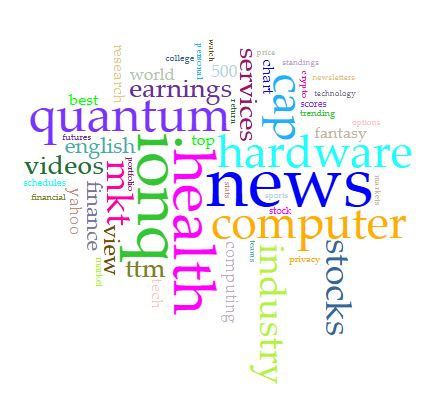



# Distant Reading Assignment 

##Voyant
-	What can you discern about the text from these results?
  
I can discern that the text uses certain words several times.

- What can't you know from these results?

I have no way of discerning the context behind them using these words at any point and at times can be very misleading.

- Are these results accurate?

No, the results go into more than the article itself, voyant dove into other articles on the website which affected the word results even though I only input one link to one article.

##CoPilot
- What can you discern about the text from these results?
  
Instantly I am able to discern significantly more/higher quality information from CoPilot, it tells me the contents of the article and surrounding information needed to understand what is being conveyed.

- What can't you know from these results?
  
I won’t know exactly what is being said in the article since it is being fed through an AI that is filtering back the information it has found, however every point being made has a link to back up its sources and allows you to do your own research.

- Are these results accurate?
  
From the parts I recognize it seems to be accurate. But it also includes sources to do my own research with and back up its points.

**CoPilot Replies**

https://finance.yahoo.com/quote/IONQ/

Copilot said:
You can view the full details for IonQ, Inc. (NYSE: IONQ) directly on Yahoo Finance here:
👉 IonQ, Inc. (IONQ) Stock Price, News, Quote & History - Yahoo Finance

This page includes:
•	Real-time stock price
•	Historical performance
•	Financials and earnings
•	Analyst ratings
•	News and press releases
•	Company profile and key statistics
Would you like a summary of the latest headlines or a breakdown of their financials from that page?

IonQ, Inc. (IONQ) Stock Price, News, Quote & History - Yahoo Finance
finance.yahoo.com

You said:
summarize its contents

Copilot said:
Here’s a comprehensive summary of the IonQ, Inc. (NYSE: IONQ) page on Yahoo Finance
________________________________________
📊 Stock Snapshot
•	Current Price: $42.27
•	Market Cap: $12.54 billion
•	52-Week Range: $6.54 – $54.74
•	Volume: ~13.1 million shares
•	EPS (TTM): -2.06
•	PE Ratio: Not applicable (negative earnings)
•	1-Year Return: +500.71%
•	YTD Return: +0.81%
•	Analyst Target Price: Average $51.00 (High: $70.00, Low: $32.00)
________________________________________
🧠 Company Overview
IonQ develops trapped-ion quantum computers and quantum networks. It offers:
•	Cloud access via AWS, Azure Quantum, and Google Cloud
•	Quantum-safe networking, quantum key distribution, and single-photon detectors
•	Consulting and hardware development services
It has a notable collaboration with AstraZeneca for quantum-accelerated computational chemistry.
________________________________________
🧪 Recent Developments
1.	Breakthrough in Quantum Materials
IonQ announced a major advancement in creating quantum-grade diamond films with Element Six (De Beers Group). This enables scalable quantum networking using standard semiconductor processes
2.	Intellectual Property Expansion
IonQ now holds over 1,000 patents and applications, including:
•	Portable quantum memory packages
•	Self-aligned fabrication for improved photonic coupling
3.	Leadership Update
Inder M. Singh was appointed as CFO and COO, signaling a strategic push toward operational scaling
________________________________________
📉 Financial Highlights
•	Revenue (TTM): $52.37M
•	Net Income (TTM): -$463.58M
•	Cash on Hand: $546.85M
•	Debt/Equity: 1.63%
•	Levered Free Cash Flow: -$19.28M
________________________________________
📈 Performance vs. Peers
Compared to other quantum computing stocks:
•	Rigetti (RGTI): $15.12 | Market Cap: $4.9B
•	D-Wave (QBTS): $15.29 | Market Cap: $5.2B
•	Quantum Computing Inc. (QUBT): $14.76 | Market Cap: $2.36B
IonQ leads in valuation and growth trajectory.
________________________________________
Would you like a visual chart of IonQ’s performance or a comparison with AI-related stocks?
1
IonQ, Inc. (IONQ) Stock Price, News, Quote & History - Yahoo Finance
finance.yahoo.com
2
IonQ (IONQ) Stock Trades Up, Here Is Why - Yahoo Finance
finance.yahoo.com
3
IonQ, Inc. (NYSE:IONQ) Reports Significant Advances in its Intellectual ...
finance.yahoo.com

